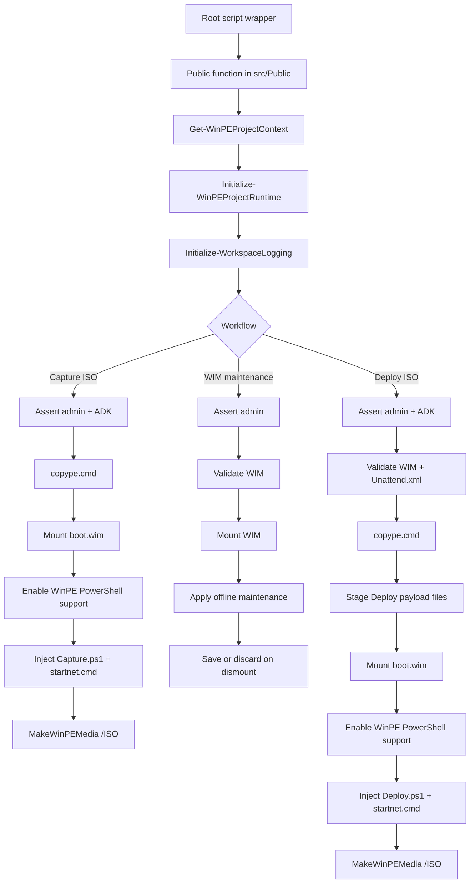

# Project Architecture Overview

This document explains how the `winpe-deployment-lab` repository works today.

It is written primarily for portfolio reviewers who want to understand the project as a designed automation system rather than as a loose collection of scripts. It should also help future maintainers quickly orient themselves before making changes.

## Why This Helps As A Portfolio Project

For a portfolio reviewer, the most useful takeaway is that the repository demonstrates more than a few ad hoc imaging scripts.

The project shows:

- script-first endpoint engineering with a clear internal structure
- repo-local runtime design instead of throwaway generated workspaces
- safe handling of unattended deployment boundaries and local-only sensitive files
- practical WinPE, DISM, WIM, and post-deployment orchestration
- reusable shared runtime helpers rather than duplicated script logic

That is the main reason a project architecture overview adds value here: it makes the design work visible, not just the feature list.

## Why This Project Is Worth Mapping

The repository solves a narrow lab deployment problem, but it does so with a deliberate shape:

- thin root-level entry scripts for operator convenience
- public functions under `src/Public` for the main workflows
- shared runtime and validation helpers under `src/Private`
- checked-in configuration and payload templates separated from runtime artifacts
- repo-local `Build` folders that keep logs, WIMs, ISO output, and mount paths predictable

That structure is part of the portfolio value of the repository. The code is not just calling ADK tools in sequence. It is organized so that initialization, capture media creation, deployment media creation, offline maintenance, payload staging, and native-tool execution can evolve without collapsing into one large script.

## Script Load And Execution Model

This repository is script-first rather than module-first.

The root-level scripts are the operator entry points:

- `New-WinPEWorkspace.ps1`
- `New-WinPECaptureISO.ps1`
- `New-WinPEDeployISO.ps1`
- `Maintain-WIMImage.ps1`

Those wrappers intentionally stay thin. Internally they hand off to public functions under `src/Public`:

- `New-WinPEWorkspace.ps1` -> `Initialize-WinPEProject`
- `New-WinPECaptureISO.ps1` -> `New-WinPECaptureIso`
- `New-WinPEDeployISO.ps1` -> `New-WinPEDeployIso`
- `Maintain-WIMImage.ps1` -> `Update-WinPEWimImage`

This keeps the user experience simple for an operator in an ADK shell while still giving the implementation a cleaner internal structure.

## Public Workflow

The main public functions form a layered workflow rather than four unrelated scripts.

### 1. Project Initialization

`Initialize-WinPEProject` validates the checked-in configuration, derives the repo-local runtime paths, ensures the required `Build` subfolders exist, and initializes logging.

This establishes the project context used by every later workflow.

### 2. Capture ISO Build

`New-WinPECaptureIso` creates a temporary WinPE working tree, mounts `boot.wim`, enables WinPE PowerShell support, injects a generated `Capture.ps1` payload plus a thin `startnet.cmd`, and builds a capture ISO.

The generated WinPE runtime then:

- refreshes boot information
- ensures `C:` is assigned
- creates the configured capture folder if needed
- captures the reference image with DISM to the configured location

### 3. Offline WIM Maintenance

`Update-WinPEWimImage` validates the configured WIM under `Build\WIM`, mounts it offline, applies the scripted maintenance step, and saves or discards changes based on success.

The current maintenance step is intentionally narrow: removing the offline `C:\CapturedImages` folder before the WIM is used for deployment.

### 4. Deployment ISO Build

`New-WinPEDeployIso` validates the captured WIM and local `PayloadTemplates\Unattend.xml`, creates a temporary WinPE working tree, stages deployment payload files, customizes `boot.wim`, injects a generated `Deploy.ps1` payload plus a thin `startnet.cmd`, and builds a deployment ISO.

The generated WinPE runtime then:

- locates the mounted ISO
- partitions the target disk with DiskPart
- applies the WIM with DISM
- configures boot files with `bcdboot`
- stages `Unattend.xml` into `C:\Windows\Panther`
- stages `SetupComplete.cmd` and `PostDeploy.ps1` into `C:\Windows\Setup\Scripts`
- shuts the WinPE environment down cleanly

## Runtime Flow

The shared initialization path is one of the most important architectural choices in the repo. All of the major workflows derive their context and runtime paths the same way before branching into capture, maintenance, or deployment behavior.

## Core Runtime Contracts

This repository is not a formal PowerShell module with exported object contracts, but it still has stable internal runtime shapes and boundaries that matter.

### Project Context Contract

`Get-WinPEProjectContext` returns a context object containing:

- `ProjectRoot`
- `ConfigPath`
- `Config`
- `Paths`

The required config values are:

- `BootISOName`
- `WIMName`
- `DeployISOName`
- `ImageDescription`
- `CaptureLocation`

The derived path set includes the repo-local runtime roots for:

- `Build`
- `Build\ISO`
- `Build\WIM`
- `Build\Logs`
- `Build\Mount`
- capture, deploy, and WIM mount subfolders
- capture and deploy WinPE work roots
- `PayloadTemplates`

This context object is the common source of truth for every main workflow.

### Payload Boundary Contract

The project draws a deliberate line between tracked templates and local-sensitive deployment content.

Tracked payload templates include files such as:

- `Diskconfig.txt`
- `Assign-C.txt`
- `SetupComplete.cmd`
- `PostDeploy.ps1`

Local-only deployment content includes:

- `PayloadTemplates\Unattend.xml`

That boundary is part of the architecture, not just a Git hygiene detail.

### Runtime Artifact Contract

The repository itself is the workspace, but runtime artifacts stay under `Build` rather than mixing with tracked source.

That means:

- source and configuration stay easy to review
- logs and generated ISO/WIM artifacts stay predictable
- cleanup and troubleshooting happen in one known local area

## Private Helper Responsibilities

The private implementation is easiest to understand when grouped by responsibility.

### Context, Validation, And Runtime Setup

These helpers establish the shared execution context:

- `Get-WinPEProjectContext`
- `Initialize-WinPEProjectRuntime`
- `Assert-AdministratorSession`
- `Assert-AdkEnvironment`

They make the public workflows safer and more consistent before any image work begins.

### WinPE Customization Support

These helpers support `boot.wim` customization for capture and deployment media:

- `Get-WinPEOptionalComponentPath`
- `Enable-WinPEPowerShellSupport`
- `Prepare-MountDirectory`

This is what allows the project to stay PowerShell-first inside WinPE while still respecting the `startnet.cmd` bootstrap model required by WinPE.

### Native Tool And File-System Execution

These helpers reduce command-invocation fragility and cleanup drift:

- `Invoke-ExternalTool`
- `Remove-ItemIfPresent`

They keep native tool execution and temporary-path cleanup out of the higher-level workflow functions.

### Logging

Logging is split into its own root helper script:

- `Write-WorkspaceLog.ps1`

The public functions all initialize workspace logging early so both successful progress and failures can be reviewed from a predictable repo-local location.

## Behavioral Contracts That Matter

Several behaviors are important to understanding the project correctly:

- the repository is the workspace, so runtime paths are derived rather than configured arbitrarily
- ADK-dependent workflows fail early if the operator is not elevated or not running in the right shell
- capture and deployment builds both customize `boot.wim` rather than treating WinPE media as a static artifact
- `Unattend.xml` is intentionally local-only and required for deployment media generation
- mount and dismount flows use save-or-discard behavior so failures do not silently leave image state half-applied
- post-deploy software installation is intentionally staged after imaging rather than baked into the base image by default

These are part of the project design, not just implementation accidents.
